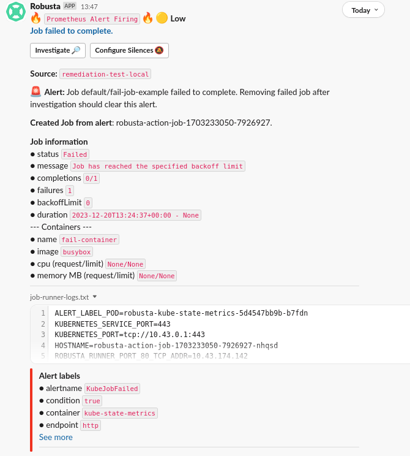

# Introduction
Remediate Prometheus alerts by taking action. Built for people using Prometheus and Kubernetes.

Supports kube-prometheus-stack and other common Prometheus distributions.

# Supported Actions

* Run a Kubernetes Job
* ...more coming soon

# Setup
1. [Install Robusta with Helm](https://docs.robusta.dev/master/installation.html)
2. Load the alert remediation playbooks. Add the following to `generated_values.yaml`: 
```
playbookRepos:
  alert_remediation:
    url: "https://github.com/robusta-dev/prometheus-remediation.git"

customPlaybooks:
# Change the following line according to your needs
- triggers:
  - on_prometheus_alert:
      alert_name: TestAlert
  actions:
  - run_job_from_alert:
      # you can access information from the alert by environment variables
      command:
      - sh
      - -c
      - "$ALERT_NAME fired... Now dumping all available environment variables, which include alert metadata and labales" && env && sleep 60"
      image: busybox
      notify: true
      wait_for_completion: true
      completion_timeout: 100
      # you can also inject secrets from the Robusta pod itself into the remediation Job's Pod
      env_vars:
      - name: GITHUB_SECRET
        valueFrom:
          secretKeyRef:
            name: robusta-github-key
            key: githubapikey
```

3. Do a Helm upgrade to apply the new values: `helm upgrade robusta robusta/robusta --values=generated_values.yaml --set clusterName=<YOUR_CLUSTER_NAME>`

4. [Send your Prometheus alerts to Robusta](https://docs.robusta.dev/master/user-guide/alert-manager.html). Alternatively, just use Robusta's bundled Prometheus stack.

Instead of waiting around for a Prometheus alert, lets cause one.

```
robusta demo-alert --alert=TestAlert --labels=label1=123,label2=abc
```

If running multiple times in a row, change a label value each time so that AlertManager doesn't supress retransmissions.

# Sample Alerts



# Community
[Ask questions and request features on our Slack.](https://home.robusta.dev/slack)
                                                                                                                                                  
